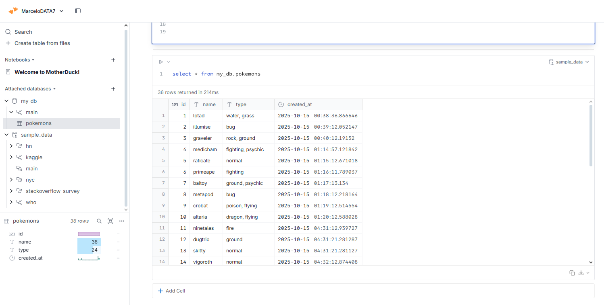
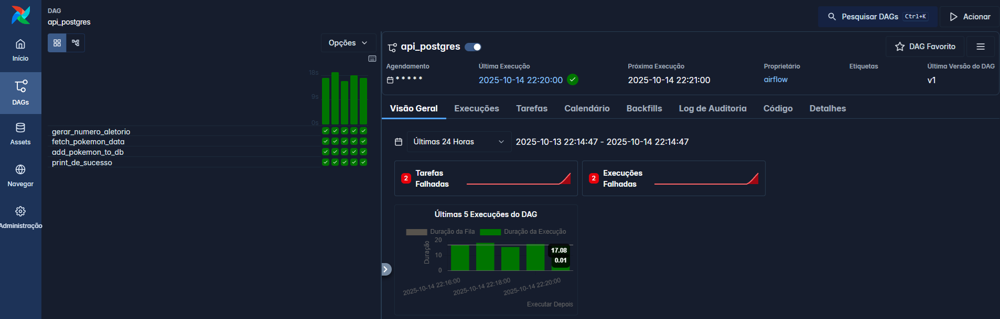

# Projeto-Airflow
É uma excelente adição\! Incluirei uma seção detalhada sobre como o usuário pode fazer o *setup* e rodar o projeto localmente usando Docker e Astro CLI.

## Pokémon Data Ingestion and Database Migration Pipeline

Este projeto demonstra um pipeline de engenharia de dados completo, que coleta dados de uma API externa, valida-os, armazena-os em um banco de dados em nuvem e, em seguida, realiza uma migração de dados em lote para um banco de dados local.

Utilizamos uma combinação robusta de tecnologias modernas para construir, orquestrar e implantar esta solução.

### 💻 Tecnologias Utilizadas

| Categoria | Tecnologia | Uso |
| :---: | :---: | :--- |
| **Linguagem** | Python | Lógica do pipeline, scripts de extração e validação. |
| **Orquestração** | Apache Airflow / Astronomer | Orquestração do fluxo de trabalho (DAGs) e agendamento a cada minuto. |
| **Containerização** | Docker | Ambiente de desenvolvimento e deploy consistente. |
| **Banco de Dados (OLTP)** | PostgreSQL (Render Cloud) | Armazenamento principal e em tempo real dos dados coletados. |
| **Banco de Dados (OLAP/Local)** | DuckDB | Migração e processamento em lote dos últimos 5 registros. |
| **Implantação (Cloud)** | AWS (via Astronomer) | Implantação e gerenciamento do ambiente Airflow. |
| **API** | API de Pokémon (Externa) | Fonte de dados para extração de informações aleatórias de Pokémon. |
| **CLI** | Astro CLI | Ferramenta para desenvolvimento local e deploy do Airflow. |

### 🚀 Funcionalidades do Projeto

1.  **Extração de Dados:** Coleta informações (nome, tipo) de um Pokémon aleatório de uma API externa usando a biblioteca `requests`. O horário da extração também é registrado.
2.  **Validação de Dados:** Utiliza **Pydantic** para validar o contrato de dados, garantindo que as informações extraídas estejam no formato e tipo esperados antes de serem inseridas no banco.
3.  **Carregamento em Tempo Real:** O Airflow agenda a execução do pipeline a **cada minuto**, inserindo o novo registro diretamente no banco de dados **PostgreSQL** hospedado na **Render Cloud**.
4.  **Migração de Dados em Lote (Batch):** A cada execução, uma task separada é responsável por:
      * Capturar os **5 últimos registros** do PostgreSQL.
      * Inserir esses dados em *batch* no **DuckDB** (banco de dados analítico local no contexto do Airflow). Esta etapa demonstra um processo simples de *migração* e *acumulação* de dados de um OLTP para um OLAP.
5.  **Exploração do Airflow:**
      * O projeto explora **diversas formas de se criar uma DAG** e **ordenar tasks**.
      * Demonstra a **customização de operadores de banco de dados** ao interagir com o DuckDB, tanto utilizando a interface (UI) do Airflow para adicionar a conexão quanto implementando a lógica de conexão diretamente via código.

### 🔧 Como Baixar e Testar o Projeto Localmente (Docker & Astro CLI)

A maneira mais eficiente de testar e desenvolver este projeto é utilizando o **Astro CLI**, que gerencia o ambiente Docker completo do Airflow, garantindo que todas as dependências (Python, Airflow e o sistema operacional) estejam isoladas e corretas.

#### Pré-requisitos

1.  **Docker:** Deve estar instalado e em execução em sua máquina.
2.  **Astro CLI:** Instale a ferramenta de linha de comando da Astronomer.

#### 1\. Clonar o Repositório

Baixe o código do projeto:

```bash
git clone https://github.com/Marcelo2506/Projeto-Airflow.git
cd Projeto-Airflow
```

#### 2\. Configurar Variáveis de Conexão

Para que o Airflow se conecte ao seu PostgreSQL na Render, você precisará configurar as variáveis de ambiente.

Crie um arquivo chamado **`.env`** na pasta raiz do projeto e adicione as suas credenciais do PostgreSQL (Render):

```bash
# Exemplo de configuração de conexão para o PostgreSQL na Render
POSTGRES_HOST=<SEU_HOST_POSTGRES>
POSTGRES_USER=<SEU_USER_POSTGRES>
POSTGRES_PASSWORD=<SUA_SENHA_POSTGRES>
POSTGRES_DB=<SEU_BANCO_POSTGRES>
POSTGRES_PORT=5432
```

*O Astro CLI utilizará este arquivo para injetar as variáveis de ambiente dentro dos containers do Airflow.*

#### 3\. Iniciar o Ambiente Airflow (Docker)

Com o Astro CLI, você pode inicializar o Airflow e todos os serviços de suporte (Scheduler, Webserver, Worker, etc.) com um único comando:

```bash
astro dev start
```

Este comando fará o seguinte:

1.  Construirá a imagem Docker do projeto, instalando todas as dependências listadas.
2.  Levantará os containers do Airflow e do Postres local (usado pelo Airflow para metadados).
3.  As DAGs serão carregadas automaticamente.

Para garantir a segurança e a funcionalidade correta do pipeline:
Certifique-se de que a linha AIRFLOW__CORE__ALLOWED_DESERIALIZATION_CLASSES=include.schema.PokemonSchema esteja presente no seu arquivo .env e que build-essential esteja em packages.txt.

#### 4\. Acessar a UI do Airflow

Após o comando `astro dev start` finalizar (pode levar alguns minutos na primeira vez), acesse a interface do Airflow:

**URL:** `http://localhost:8080/`
**Login Padrão:** `admin`
**Senha Padrão:** `admin`

Você poderá ver as DAGs listadas e observar as execuções sendo agendadas e rodando a cada minuto.

#### 5\. Parar o Ambiente

Quando terminar de testar, utilize o seguinte comando para derrubar os containers e limpar os recursos:

```bash
astro dev stop
```

### 📦 Estrutura e Extensibilidade

O código do projeto foi implementado com foco em **organização de páginas** e **lógica de programação limpa**, permitindo que ele seja facilmente compreendido e **incrementado** como qualquer outro projeto de desenvolvimento de software robusto.

### 🛠️ Implantação em Nuvem

O projeto é completo e otimizado para a plataforma Astronomer (deploy em nuvem, como na AWS). O deploy pode ser feito de forma simples utilizando o **Astro CLI** após configurar o *Workspace*:

```bash
astro deploy
```

### 📝 Dependências Adicionais

Este projeto utiliza as seguintes bibliotecas Python, que devem ser instaladas (e estão configuradas no `Dockerfile` e `requirements.txt` para o Astro CLI):

```
requests >=2.32.5,<3.0.0
python-dotenv >=1.1.1,<2.0.0
pydantic >=2.12.0,<3.0.0

duckdb >=1.4.1,<2.0.0
airflow-provider-duckdb >=0.2.0,<0.3.0
astro-sdk-python[duckdb] >=1.8.1,<2.0.0
apache-airflow-providers-postgres
```

### 🖼️ Resultados e Evidências

As seguintes imagens demonstram o projeto em execução e seus resultados:

#### 1. Consulta ao PostgreSQL (PgAdmin)
Mostra que os dados (id, nome, tipo, `created_at`) estão sendo corretamente inseridos e acumulados no banco de dados PostgreSQL.


#### 2. Consulta ao DuckDB (DuckerDB UI)
Mostra o resultado da migração em lote dos dados do PostgreSQL para o DuckDB, que armazena os registros acumulados em um fluxo de migração.



#### 3. Orquestração no Airflow (Webserver)
Visão da interface padrão do Airflow, confirmando o agendamento e o status de sucesso das DAGs.



#### 4. Implantação e Monitoramento (Astro CLI/Astronomer)
Visão da plataforma Astronomer/Astro CLI, demonstrando o ambiente de deploy gerenciado na nuvem.

